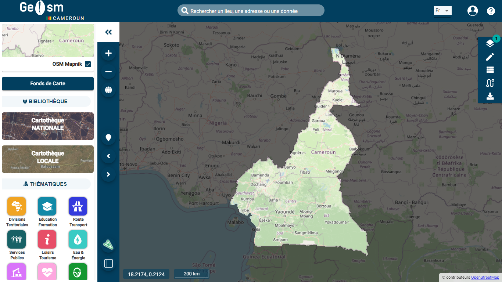

# GeOsm Frontend v1.2.0



This project was generated with [Angular CLI](https://github.com/angular/angular-cli) version 12.0.4.

## Instalation

Run

```sh
$ git clone https://github.com/GeOsmFamily/geosm-frontend-final.git
$ npm install

```

- download the [country.geojson](https://service.geo.sm/var/www/country.geojson) file which contains the boundary of your country (by default it is Cameroon) and place it in /src/assets

- If you want to change the payload replace the content of country.geojson by the geojson of your country

create the enviroment.ts(/src/environments/environment.ts) file and add your configurations to it

```sh
export const environment = {
  production: false,
  global_logo: undefined,
  primaryColor: '#023f5f',
  url_prefix: 'url_backend/',
  url_frontend: 'urlFrontend/',
  url_service: 'https://service.geo.sm/',
  path_qgis: '/var/www/geosm/',
  projet_nodejs: 'pojet_nodejs_value',
  nom: 'nomInstance',
  countrycode: 'code_country',
  avaible_language: ['fr', 'en'],
  default_language: 'langue',
};

```

| variable         | expected value                                                |
| ---------------- | ------------------------------------------------------------- |
| primaryColor     | Main color of the geoportal                                   |
| url_prefix       | Url of your Laravel backend                                   |
| url_frontend     | url on which your application will be deployed                |
| url_service      | url on which your nodeJs server is deployed                   |
| path_qgis        | directory where your qgis projects are located on your server |
| nom              | name of your instance                                         |
| countrycode      | iso 2 code of the country you are deploying                   |
| avaible_language | code of available languages                                   |
| default_language | default label of your instance                                |

- the installation of the GeOsm client on your own server requires the installation and configuration of the Laravel backend (for the administration) and the Node_Js backend (for the cartographic part)

- Backend laravel repository : https://github.com/GeOsmFamily/geosm-backend.git

- NodeJs Backend repository : https://github.com/GeOsmFamily/geosm-backend-nodejs.git

- If you wish to use our backend already available and hosted on our servers, send us an email (infos@geo.sm) and we will assist you in your configuration

- You can submit a new language by creating a language file with the language code in: assets/i18n/{languagecode}.json

## Development server

Run `ng serve` for a dev server. Navigate to `http://localhost:4200/`. The app will automatically reload if you change any of the source files.

## Code scaffolding

Run `ng generate component component-name` to generate a new component. You can also use `ng generate directive|pipe|service|class|guard|interface|enum|module`.

## Build

Run `ng build` to build the project. The build artifacts will be stored in the `dist/` directory. Use the `--prod` flag for a production build.

## Contributions

- This Project is open source and open to all your improvements.

Thank you for supporting our Project
